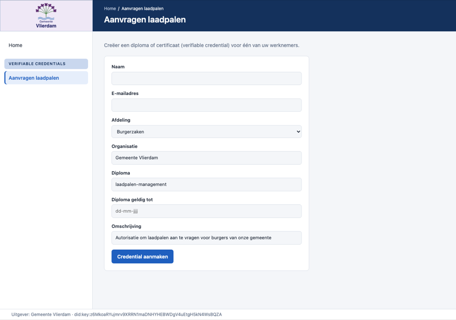
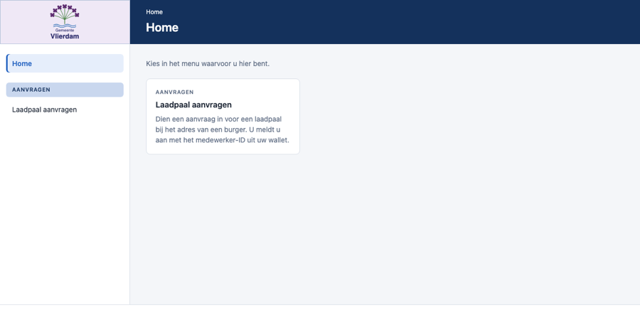

# attesta

A Go backend that authorizes requests based on verifiable credentials that users present from their own wallet. An application asks the backend to
start an authorization; the user's wallet answers with an SD-JWT presentation that discloses only what was asked for; the backend verifies it and
runs the result through an **authorization policy written in Gno**, evaluated in-process by [gnovm](https://github.com/gnolang/gno), gno.land's VM,
embedded directly in the backend.

Presentations use selective disclosure (SD-JWT): the holder reveals only the requested claims, but the issuer's signature
and the holder's key are the same in every presentation, so verifiers that compare notes can tell it is the same credential.

This is a monorepo: the backend, a TypeScript client library, a wallet core, and two examples (a demo issuer and the laadpalen app, a relying application).

## Architecture

How the pieces fit together, with the end-to-end flow and the design of the next steps, is in [docs/architecture.md](docs/architecture.md).

Key design decisions:

| Area | Decision |
|---|---|
| Credentials | SD-JWT VC, issued with OpenID4VCI (pre-authorized code) and presented with OpenID4VP (DCQL query, `direct_post`) |
| Issuer identity | an Ed25519 `did:key`; the key is in the DID, so resolving needs no network. Which issuers are trusted is the policy's decision, by DID |
| Verifier identity | requests are unsigned and identify the verifier by its response URI (`redirect_uri` client identifier prefix), so there is no verifier key to manage |
| Identity | the holder is identified by the `email` claim of their credential, together with the issuer's DID. Every request asks the wallet for it, a presentation without it is rejected, and an allowed outcome carries it as `subject`; a denial does not, since an untrusted issuer's claims prove nothing |
| Replay protection | each request carries a fresh nonce and state and can be answered once; the key-binding JWT must name this request's nonce and response URI and be at most five minutes old |
| Gno integration | gnovm embedded in-process as a library (`gnovm/pkg/gnolang`) — no gno.land chain/node. A policy is one file with `Authorize(resource, credType, issuer string, claims map[string]string) (bool, string)`; `claims` holds the claims the request asked for, the email included, and a request fails unless the wallet disclosed all of them. Text claims arrive as they are, other values as JSON |
| Wallet | a desktop app (Electron) on [Credo](https://github.com/openwallet-foundation/credo-ts); keys and credentials live in an encrypted Askar store on the user's machine, and the user confirms every offer, and every disclosure unless they chose to always share with that application |
| TS workspace | pnpm workspace (root `pnpm-workspace.yaml`) linking `client-lib`, `wallet`, `wallet-desktop`, `examples/issuer` and `examples/laadpalen/gui` |

## Repo layout

```
backend/
  cmd/
    attesta/          server entrypoint
    spike/            throwaway PoC validating embedded-gnovm policy calls (superseded
                       by internal/authz, kept as a minimal reference)
  internal/
    config/            env-based configuration
    sdjwt/             verifies SD-JWT VC presentations: issuer signature, disclosures, key binding; resolves did:key issuers
    presentation/      OpenID4VP verifier: builds requests, checks the wallet's answer, keeps the decision for polling
    authz/             Evaluator backed by an embedded gnovm interpreter
    scripts/           policy source store (loaded from a directory that is watched, plus admin hot-deploy)
    httpapi/           HTTP handlers wiring the above together
  Dockerfile
client-lib/                TypeScript package @attesta/client: typed client for the backend API (authorization requests, outcome polling, policy deploy)
wallet/                    @attesta/wallet: the wallet core — a Credo holder agent that accepts credential offers, answers presentation requests, and has a CLI
wallet-desktop/            @attesta/wallet-desktop: the Electron desktop wallet around the core (confirmations, credential list, link handling)
examples/
  issuer/                  demo credential issuer (Express + Credo): issues Diploma credentials through OpenID4VCI, form at /
  laadpalen/               a relying application with attesta as its sidecar: Go backend (api/), React page (gui/), policy (policies/); see its README
k8s/
  local/              manifests for Docker Desktop's local k8s
    backend/          namespace/deployment/service for the Go backend
    issuer/           deployment/service for examples/issuer (https://issuer.attesta.corbencreatives.nl, and LoadBalancer on localhost:4000)
    laadpalen/        the laadpalen app: one pod with its backend and the attesta sidecar, and its page (https://laadpalen.attesta.corbencreatives.nl; wallets reach attesta at https://api.attesta.corbencreatives.nl)
    ingress/          Ingress for those three names; Traefik terminates https (make k8s-traefik k8s-ingress)
  cloud/              (empty for now)
pnpm-workspace.yaml   client-lib + wallet + wallet-desktop + examples
Makefile              build/test/docker/k8s targets (see Development workflow)
```

## GUIs

| GUI | Where | Used for |
|---|---|---|
| Issuer | `examples/issuer` | The organisation's staff creates a verifiable credential for an employee and gets the offer link for the employee's wallet. The pages are in Dutch. |
| Laadpalen page | `examples/laadpalen/gui` | The employee's page of the laadpalen app: sign in with the wallet, then request a laadpaal. attesta decides from the credential in the wallet. |
| Wallet | `wallet-desktop` | The employee's wallet: confirms every offer, and every disclosure unless the employee chose to always share with that application. |

### Issuer

The menu on the left lists the credentials the issuer can create, grouped under a label; the page opened from the menu is shown in the header, under a
breadcrumb. The welcome page has a block per menu item that explains what it does. The footer shows which issuer the credentials are issued as.



### Laadpalen page

The same layout, with the employee's own menu: "Laadpaal aanvragen" is where the employee signs in with the wallet and submits an address. The footer shows who
is signed in, with "Afmelden".



## Development workflow

The dev/deploy/test cycle for the backend and the example page runs through Docker Desktop's built-in Kubernetes, driven by the root `Makefile`.
Quick local iteration without a container works too:

```sh
cd backend
go run ./cmd/attesta      # listens on :8080, no policies unless ATTESTA_POLICIES_DIR is set
go test ./...
```

Configuration comes from the environment: `ATTESTA_ADDR`, `ATTESTA_PUBLIC_URL` (where wallets reach the backend: it appears in every presentation
request), `ATTESTA_POLICIES_DIR`, `ATTESTA_ADMIN_TOKEN`, `ATTESTA_CORS_ORIGINS`. `internal/config` falls back to an insecure dev default for the admin token when its variable
isn't set — fine for local Docker Desktop, not fine for anything beyond it.

For the k8s loop (requires Docker Desktop running, with Kubernetes enabled):

```sh
make docker-build       # builds into Docker Desktop's local image store, tagged uniquely per build — no registry push needed
make k8s-apply           # applies k8s/local/backend/*.yaml, then points the deployment at that exact new tag via
                          # `kubectl set image`, which always triggers a real rollout (see the Makefile's own
                          # comment on why the tag can't just be reused)
make k8s-logs             # tail the running pod's logs
make k8s-port-forward     # expose the service on localhost:8080 for curl/Postman
make k8s-delete           # tear down the namespace
make k8s-policies POLICIES="a.gno b.gno"   # hot-deploys exactly these policies: the running backend picks them up, no restart
make k8s-policies-add POLICIES=a.gno       # the same, but only adds or updates this file and keeps the other policies
make k8s-issuer-apply    # deploys the demo issuer; open http://localhost:4000 for its form
make laadpalen           # deploys examples/laadpalen (needs the issuer): page at https://laadpalen.attesta.corbencreatives.nl (needs make k8s-traefik k8s-ingress once)
make laadpalen-policies  # hot-deploys that app's policies into its sidecar, no restart
```

Policies come from the ConfigMap `attesta-policies`, mounted at `/policies` (`ATTESTA_POLICIES_DIR`). The backend reads the directory every five seconds and
applies what changed without a restart: a new or changed file is validated and installed, a file that is gone takes its policy with it, and an invalid file
is rejected (logged once) while the previous version stays in use. `make k8s-policies POLICIES="a.gno b.gno"` writes the whole ConfigMap (policies not listed are removed) and `make k8s-policies-add` adds or updates
files only, and Kubernetes updates the mounted files within about a minute; `make k8s-apply` keeps the ConfigMap unless it is given `POLICIES` too. The policy ID is the file name
without `.gno`. `POST /admin/policies` hot-deploys a single policy directly and keeps working; it is held in memory until the backend restarts, and the
directory never removes it. With `k8s-policies` and `k8s-apply POLICIES=...` the list must hold every policy the backend should serve.

### TypeScript packages

```sh
pnpm install                          # from the repo root; allows the install scripts listed in pnpm-workspace.yaml
pnpm --filter @attesta/client test     # client library
pnpm --filter @attesta/issuer test     # issues credentials to an in-process wallet
pnpm --filter @attesta/wallet-desktop test:e2e   # the desktop wallet, driven like a user
```

Askar, the wallet's storage, ships a native library that its install script downloads from the OpenWallet Foundation's GitHub releases.

### Trying the whole flow

The laadpalen app and its policies are in [examples/laadpalen](examples/laadpalen/README.md):

```sh
make k8s-issuer-apply laadpalen                                # the issuer (form at http://localhost:4000) and the laadpalen app
pnpm --filter @attesta/wallet-desktop package                  # the wallet: open the app, paste the offer link from the issuer form, confirm (needs https)
```

The wallet core also has a headless CLI (`cd wallet && pnpm cli accept|present|list`), handy for scripts.

`examples/issuer/scripts/e2e.ts` runs the same flow unattended against a running backend.

## Known risks and limits

- **gnovm embedding is not an upstream-stable API.** `gnovm/pkg/test.ProdStore`
  (used to build the base `gno.Store`) is commented upstream as backing the
  `gno run`/`gno test` CLI, not production systems. `internal/authz.GnoVM`
  builds that store once and forks a `TransactionStore` per call (never
  `Write()`-ing it back) rather than reusing one long-lived store directly —
  the latter makes `store.SetCachePackage` panic on the second call with the
  same package path, which is exactly what happens under real traffic. This
  works and is tested (including a hot-reload test), but the approach isn't
  blessed by gno's maintainers. `GnoVM.Evaluate` serializes all calls behind
  a single mutex; measured (`BenchmarkGnoVMEvaluate`) at ~60µs/call on an M5
  Max, i.e. a ~16k/s ceiling on one core — not a bottleneck at this project's
  scale.
- **Presentations are linkable.** SD-JWT hides undisclosed claims but not the issuer's signature or the holder's key, so a verifier, or a verifier
  together with the issuer, can correlate presentations of the same credential.
- **No revocation.** The backend does not check a credential's status; a credential is valid until it expires.
- **The email is not checked beyond being disclosed and signed by the issuer.** Only Ed25519 `did:key` issuers are accepted.
