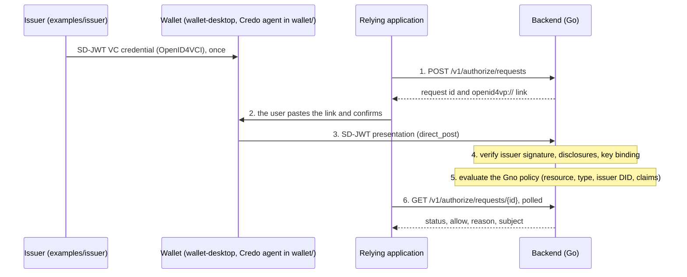
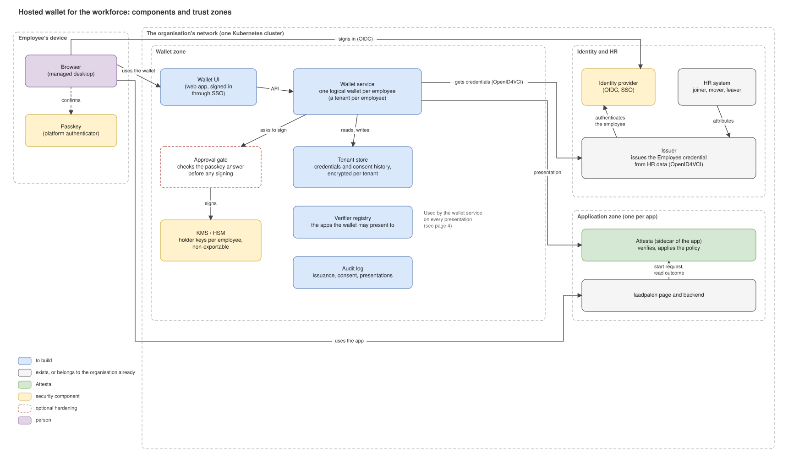
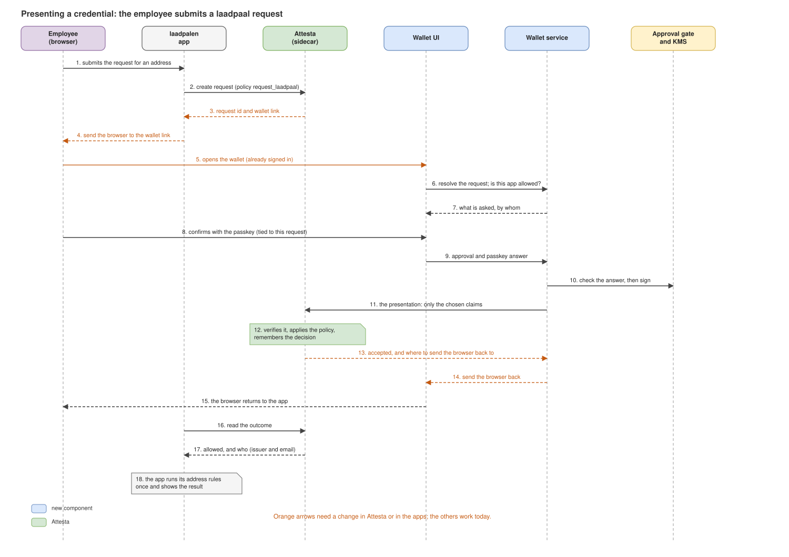
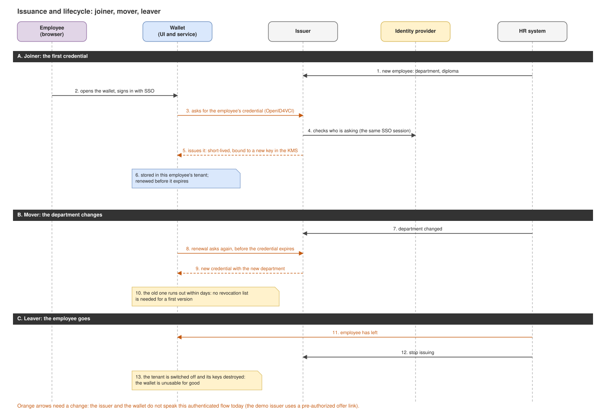
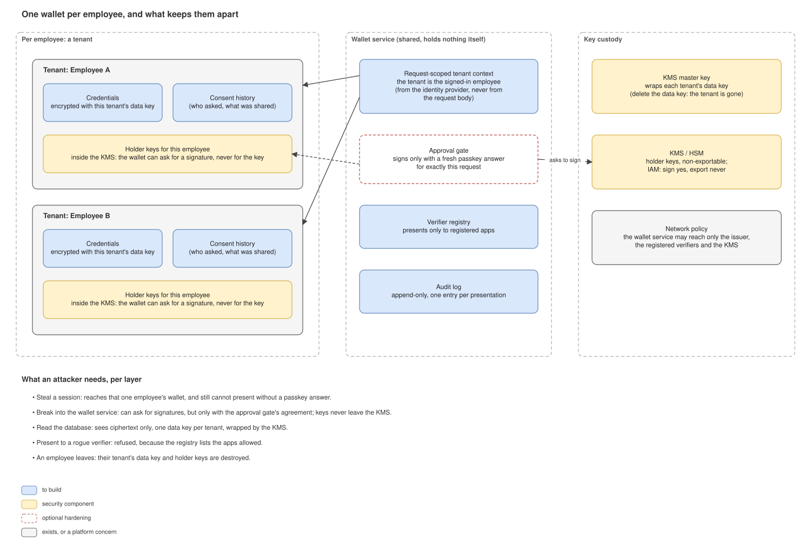

# Attesta architecture

This document describes how the pieces of Attesta fit together, and the design for the next big piece: a wallet that the organisation runs for its employees.

1. [How it works today](#1-how-it-works-today)
2. [The scenario we design for: the workforce](#2-the-scenario-we-design-for-the-workforce)
3. [Design: a wallet the organisation runs for its employees](#3-design-a-wallet-the-organisation-runs-for-its-employees)

The diagrams of section 3 are in [`architecture/hosted-wallet.drawio`](architecture/hosted-wallet.drawio) (four pages, editable in draw.io). The images in this
document and the PDF ([`architecture.pdf`](architecture.pdf)) are rendered from the same model, so they match the file.

## 1. How it works today

This is the flow between a relying application, the shared backend and the desktop wallet. It no longer shows the whole solution:

- **The laadpalen example** (`examples/laadpalen`) puts an application backend between the page and Attesta, and runs Attesta as a **sidecar** in the application's pod.
  The page never talks to Attesta; the application asks Attesta whether an employee may do something, and then does the work itself.
- **Policies** are per application, and are reloaded while Attesta runs: they come from a directory (a ConfigMap in Kubernetes) that Attesta watches.
- **Claims** the employee discloses are passed to the policy, next to the resource, the credential type and the issuer.
- **The copy and paste** of the link into the wallet is a demo shortcut. Section 3 replaces it.

## 2. The scenario we design for: the workforce

Attesta is designed for a **workforce** scenario. The people being authorized are the organisation's own employees. The organisation issues their credentials,
and the applications, the wallets and Attesta all run inside the organisation's network. There is no outside world to defend against. Because of that,
Attesta has one API and does not tell its callers apart; which workload may reach which is the platform's concern (network rules, service identity).

A **citizen or customer** scenario is different: the users are outside the organisation, choose their own wallet and bring credentials from third parties
(a national identity wallet, a bank). Attesta can act as a verifier for those wallets, but we do not build a wallet for them.

## 3. Design: a wallet the organisation runs for its employees

### 3.1 Why

Today an employee needs a wallet on their own machine and has to copy links in and out of it. That is a demo, not a product. In a workforce scenario the
organisation is the issuer, the verifier and the operator of the employee's computer, so it can run the wallet itself. The employee then never sees a link:
they sign in once, and credentials and approvals happen through ordinary web redirects.

The privacy argument against an organisation-run wallet is weak here, because the organisation already knows its employees. What still matters is
**selective disclosure towards each application** (an application learns only what it asked for) and **separation between employees** (nobody can use
another employee's wallet). The design is built around those two.

**Goals**

- No links to copy: sign-in through SSO, then redirects.
- One logical wallet per employee, kept apart from every other.
- An operator, or an attacker who reads the database, cannot use an employee's keys.
- Nothing is presented without the employee's fresh, explicit approval.
- The wallet follows the employee's life in the organisation: joiner, mover, leaver.
- Every issuance, approval and presentation is recorded.
- Attesta stays as it is: it speaks the standard issuing and presenting protocols (OpenID4VCI, OpenID4VP) and does not care which wallet answers.

**Not goals**

- Citizens and customers, and personal wallets on phones.
- Hosting wallets for several organisations in one service.
- Replacing the desktop wallet. It stays as the reference wallet and for personal use.

### 3.2 Components

| Component | Responsibility |
|---|---|
| **Wallet UI** | The web page the employee uses: signed in through SSO, shows what is asked and by whom, collects the approval. |
| **Wallet service** | Does the wallet's work for the signed-in employee: stores and selects credentials, builds the presentation, talks to issuers and verifiers. One logical wallet (a *tenant*) per employee; the service itself holds nothing. |
| **Tenant store** | Credentials and consent history of every tenant, each encrypted with its own data key. |
| **KMS / HSM** | Holds each employee's holder keys. The wallet can ask for a signature and never gets the key. Also wraps the tenants' data keys. |
| **Approval gate** (optional hardening) | A small separate component that checks the employee's passkey answer before the KMS signs, so a compromised wallet service cannot sign alone. |
| **Verifier registry** | The applications the wallet may present to. A presentation to anything else is refused. |
| **Audit log** | Append-only record of issuance, approvals and presentations. |
| **Identity provider** | The organisation's existing SSO. It tells the wallet who the employee is. |
| **Issuer** | Issues the employee credentials from HR data, over the standard protocol. Already exists as a demo; changes below. |
| **HR system** | The source of joiners, movers and leavers. |
| **Application + Attesta** | The relying application with its sidecar. Attesta verifies the presentation and applies the application's policy. |

### 3.3 Presenting a credential

The employee uses the laadpalen application. The application asks its Attesta for a request and sends the employee's browser to the wallet. The wallet,
where the employee is already signed in, shows who asks and what would be shared. The employee approves with a passkey that is tied to this one request.
The wallet service lets the KMS sign, sends the presentation to Attesta, and the browser goes back to the application. Attesta has verified the
presentation and applied the policy; the application reads the outcome and does its work once.

Orange arrows are what does not work today and has to change:

- **The wallet link** is an ordinary web address of the organisation's wallet instead of an `openid4vp://` link that has to be pasted.
- **The way back.** After the answer, Attesta tells the wallet where to send the browser back to (the standard "redirect after direct post" of OpenID4VP,
  protected with a one-time code). Today Attesta answers with an empty reply.

### 3.4 Getting a credential, and what happens when people change

- **Joiner.** The employee opens the wallet and signs in. The wallet asks the issuer for their credential, and the issuer checks who is asking through the
  same SSO session (the standard authorization-code flow of OpenID4VCI) and reads the department and diploma from HR. The credential is **short-lived**
  (days, not years) and bound to a new key inside the KMS.
- **Mover.** The wallet renews the credential before it expires. After a change in HR, the next credential carries the new department, and the old one runs
  out within days. Because credentials are short-lived, the first version needs no revocation list.
- **Leaver.** HR tells the wallet and the issuer. The employee's tenant is switched off and its keys destroyed, so the wallet cannot be used again.
- **Recovery needs no backup.** Credentials are short-lived and re-issued after sign-in, so a lost or broken wallet is repaired by signing in again. Only the
  consent history needs a backup.

### 3.5 One wallet per employee, and what keeps them apart

"One wallet per employee" is a **logical** separation: separate storage, separate keys and a tenant context that comes from the identity provider. It is not a process or a
pod per employee. What stops each threat:

| Threat | What stops it |
|---|---|
| A stolen session | It reaches one employee's wallet only, and cannot present without a fresh passkey answer. |
| A break-in to the wallet service | It can ask for signatures, but with the approval gate only for requests the employee approved; keys never leave the KMS. |
| A leaked database | Only ciphertext, one data key per tenant, wrapped by the KMS master key. |
| A rogue or look-alike verifier | The registry lists the applications the wallet may present to; the wallet shows the verifier's registered name, not what the request claims. |
| An operator with access | No cross-tenant administration interface; keys are not extractable; access to the KMS is audited. |
| An employee who leaves | The tenant's data key and holder keys are destroyed. |
| A replayed presentation | Already covered by Attesta: each request has its own nonce, is answered once, and expires after five minutes. |

### 3.6 Decisions

| Decision | Options | Choice and why |
|---|---|---|
| How wallets are separated | A process per employee, one service with a tenant per employee, one shared wallet | **One service, a tenant per employee.** The isolation comes from storage and keys, not from processes; a pod per employee costs a lot and adds no security. |
| Where holder keys live | In the KMS or HSM, or encrypted in the tenant store | **In the KMS where there is one.** Non-exportable keys are the main protection against an operator or a database leak. Without a KMS, keys sit in the tenant store under a data key wrapped by a master key; that is weaker and the spike decides per environment. |
| What approves a presentation | The SSO session alone, or a passkey per presentation | **A passkey per presentation, tied to the request.** A stolen session then cannot present. |
| Who checks the passkey | The wallet service, or a separate approval gate | **The wallet service first, the gate as hardening.** The gate stops a compromised service from signing alone. |
| How the wallet is reached | A custom link scheme, or the organisation wallet's web address | **The web address.** The application knows the wallet; no installed handler is needed. |
| Who may be presented to | Anyone who asks, or registered applications | **Registered applications only.** Possible because everything is inside one organisation. |
| Credential lifetime | Long-lived with revocation, or short-lived with renewal | **Short-lived with renewal.** It fits Attesta, which already checks expiry, and avoids a revocation list for now. |
| How credentials are issued | A pre-authorized offer link, or the authorization-code flow through SSO | **Authorization-code through SSO.** No link to hand over, and the issuer knows who asks. |
| The tenant's identity | A wallet-specific account, or the identity provider's subject | **The identity provider's subject.** One identity, managed by the organisation. |

### 3.7 What has to change

- **Attesta:** answer a presentation with a redirect target and a one-time code, so the browser can return to the application; build the request link from the
  organisation wallet's address when one is configured. The policy and the verifying stay as they are.
- **Issuer:** the authorization-code flow with the organisation's identity provider, short-lived employee credentials, HR attribute mapping and renewal.
  The demo issuer keeps the pre-authorized flow for the desktop wallet.
- **Wallet:** a new multi-tenant wallet service and web UI. The existing wallet core (`wallet/`) is reused for credentials and presentations.
- **Applications (laadpalen):** send the browser to the wallet link and handle the return; the page no longer shows a link to paste.
- **Platform:** a KMS or HSM, an identity provider with passkey support, network policies, an audit sink.

### 3.8 Open questions and risks

- Is a KMS or HSM available in the environments we target? Without one, the keys are weaker.
- Do the managed desktops support passkeys (platform authenticators)?
- Does Credo, the wallet framework we use, do what the design assumes: multiple tenants in one agent, signing through an external KMS, and the redirect after a
  presentation? These are assumptions to **verify in the first spike**, not facts.
- An organisation-run wallet records every approval. That is a privacy matter for employees, so it needs the works council's agreement and a clear retention rule.
- Concentration risk: a compromised service reaches many wallets. The KMS, the passkey per presentation and the approval gate exist to limit it.
- Employees away from managed desktops (phones, shared computers) are not covered.

### 3.9 Build in phases

1. **Spike.** Two tenants in one Credo agent with software keys; check external KMS signing and the redirect after a presentation. Done when two employees' wallets are shown to be isolated.
2. **Sign-in, approval and the same-device flow** with the laadpalen application: SSO, consent screen, redirect there and back; software keys, no passkey yet.
3. **Passkey and KMS.** Passkey per presentation tied to the request; holder keys in the KMS; per-tenant data keys.
4. **Issuance and lifecycle.** Authorization-code issuance through SSO, renewal, HR events for movers and leavers, the audit log.
5. **Hardening.** The approval gate, network policies, a status list if short lifetimes are not enough, operations (backups of the consent history, recovery).

## Appendix: the diagram files

`architecture/hosted-wallet.drawio` has four pages: *1 Containers*, *2 Presentation*, *3 Issuance and lifecycle*, *4 Isolation and trust*. Open it with
draw.io (diagrams.net) to edit. The `.svg` files and the PDF are rendered from the same model; after editing the `.drawio`, export new images from draw.io
if you want them to match.
